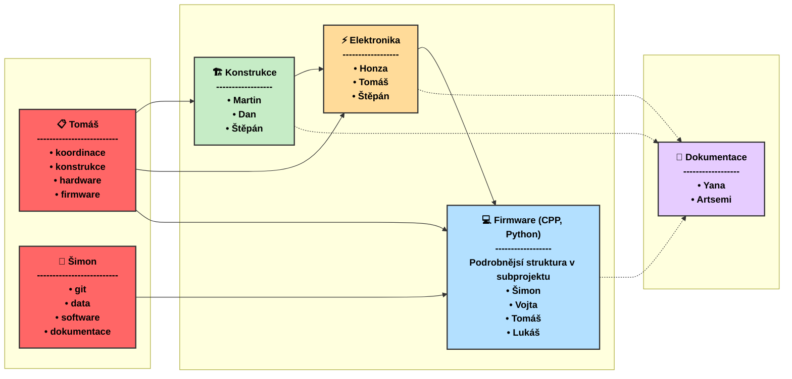

# Projekt MSS opto 2025 🛠️
## Tým
Artsemi, Dan, Honza, Lukáš, Martin, Šimon, Štěpán, Tomáš, Tomáš a Yana

## Organizační struktura projektu

## Harmonogram projektu

| Téma schůzky | Průběh | 🏗️ Konstrukce | ⚡ Elektro | 💻 Firmware | 📝 Dokumentace | Termín a agenda |
|-------------|:---------:|:---------:|:---------:|:-----:|:------:|--------|
| **Finální úpravy elektroniky** | 🟡 PO 31.3. / ČT 3.4.|  | ✅ | ✅ |  | • Finalizace pájení operačního zesilovače a fotodiod • Testování OZ a fotodiod • Validace schémat |
| **Rozhraní Arduino - PC** | 🟢 PO 31.3. / ČT 3.4. |  |  | ✅ |  | • Vývoj a testování API pro přenos |
| **Mechanická kompletace** | 🟡 během týdne| ✅ |  |  |  | • Montáž laserů a fotodiod(y) (nutné upravit tolerance zelených úchytů)  • Optimalizace průtoku vzduchu |
| **Dokumentace** | 🟡 během týdne|  |  |  | ✅ | • Připravit šablonu  • Vytvořit popis senzoru (teorie a popis měření)|
| **Referenční měření** | 🟡 ČT 10.4. | ✅ | ✅ | ✅ | ✅ | • Srovnávací testování s komerčním senzorem • **Nutné mít mechanicky kompletní senzor a alespoň jeden kanál pro fotodiodu funkční** |
| **Návrh miniaturizované verze senzoru** | 🔴 | ✅ | ✅ |  |  | • Navrhnout efektivní světelnou past pro menší rozměr  • ...|
| **Kalibrace** | 🔴 |  |  |  | ✅ | • Zpracovat data do závěrečné zprávy  • Kalibrovat senzor tak, aby generoval smysluplný výstup (např. ppm)|

## Týmy a řešené úkoly

### 💻 Firmware 
**Členové:** Šimon, Tomáš, Vojta a Lukáš

#### Řešené úkoly: 

| Úkol | Stav | Přiřazeno | Poznámka |
|------|------|-----------|----------|
| HX711 | 🟢 | Šimon, Vojta |  |
| Referenční sesnsor PMS7003 | 🟢 | Šimon | Ukradeno ze ZPR. |
| Implementace komunikačního API | 🟢 | Šimon, Vojta | UART, Sériová linka + JSON|
| Dvoukanálové měření | 🟢 | Šimon, Vojta | Příprava firmware a implementace |
| Čtení ze sériové linky | 🟢 | Šimon, Vojta | Vytvořit .py skript který kodáže číst data se sériové komunikace |
| Ukládání přečtených dat | 🟢 | Všichni | .py skript ukládá vhodně do .csv změřená data |
| Vhodné komentování | 🟡 | Šimon | .cpp skripty  v Doxygen a .py skripty v pydoc. Dle doporučení p. Kropíka, možnost zmněnit. |
| Nový člen týmu | ⚠️ | Lukáš | Domluvit se na novém rozdělení úkolů v týmu. Bylo odstraněno orientační přiřazení z nedokončených úkolů. Domluvíme se osobně až Lukáš bude na FEL. |
| Sjednotit jazyk komentování | 🟡 | Všichni |  Zvolit vhodný jazyk, 6.4. .cpp v angličtině a .py v češtině.  |
| Machine Learning | 🔴 |  | Vytvořit .py skript který pomocí vhodných ML modelů zpracovat data z .csv a popíše matematicky vztah mezi PMx referenčního čidla a našich naměřených dat (stav, ADC A, ADC B) |
| Kalibrace A/D převodníku | 🔴 |  | Zajištění přesnosti měření spíše HW část|
| Vyhodnocení vlivu vlnové délky | 🔴 |  | Zjístí ML |
| Kalibrace měření s referenčním senzorem | 🔴 | Elektronika | Zjistí ML a spíše půjde o vhodné umístění fyzických sensorů, proto nechávám i tady |
| Datový výstup | 🔴 |  | Vztahy z ML hodit do arduina (popř lepšího uc a posílat přes sériovou komunikaci přímo PMx) |

### 🏗️ Konstrukce
**Členové:** Martin, Dan a Štěpán

#### Řešené úkoly:

| Úkol | Stav | Přiřazeno | Poznámka |
|------|------|-----------|----------|
| Konstrukce testovacího standu | 🟢 |  |  |
| Výběr materiálu | 🟢 |  |  |
| Vhánění částic do senzoru | 🔴 |  | Vyřešit optimální proudění částic v senzoru (ideálně laminární, výběr a umístění ventilátoru) |
| Miniaturizace senzoru | 🔴 |  | Návrh kompaktní verze (zatím jen sketch) |

### ⚡ Elektronika
**Členové:** Honza, Tomáš a Štěpán

#### Řešené úkoly:

| Úkol | Stav | Přiřazeno | Poznámka |
|------|------|-----------|----------|
| Buzení laserů | 🟢 |  |  |
| Pájení OZ a fotodiody | 🟡 |  |  |
| Porovnání zesilovačů | 🔴 |  | Vyzkoušet citlivost OPA101 |
| Deska s AD převodníkem | 🟡 |  |  |
| Stínění signálových cest | 🔴 |  |  |

### 📝 Dokumentace
**Členové:** Yana a Artsemi

#### Řešené úkoly:

| Úkol | Stav | Přiřazeno | Poznámka |
|------|------|-----------|----------|
| Příprava šablony zprávy | 🔴 |  | Najít/vytvořit šablonu na závěrečnou zprávu |
| Formulace principu funkce senzoru | 🔴 |  | Stručne popsat princip a vytvořit/najít ilustrace |
| Kalibrace | 🔴 |  | Zpracovat data od týmu Data do použitelné formy |
| Přehled a citace | 🟡 |  | Průběžně udržovat seznam zdrojů a připravovat strukturu zprávy |

## Struktura submprojektů a stavy úkolů

- `/Konstrukce` - 3D modely a poznámky ke konstrukci
- `/Elektronika` - Schémata a seznamy součástek
- `/Firmware` - Zdrojové kódy firmware a pinout
- `/Dokumentace` - Příprava šablony zprávy, zpracovaná data a dokumentace API

- 🔴 **Fronta/Neproběhlo** - Úkol čeká na zahájení
- 🟡 **V řešení/Naplánováno** - Úkol je právě řešen
- 🟢 **Dokončeno/Proběhlo** - Úkol byl úspěšně dokončen
- ✅ **Vyžaduje účast** 
- ⚠️ **Důležité** - Úkol vyžadující zvýšenou pozornost
- 
